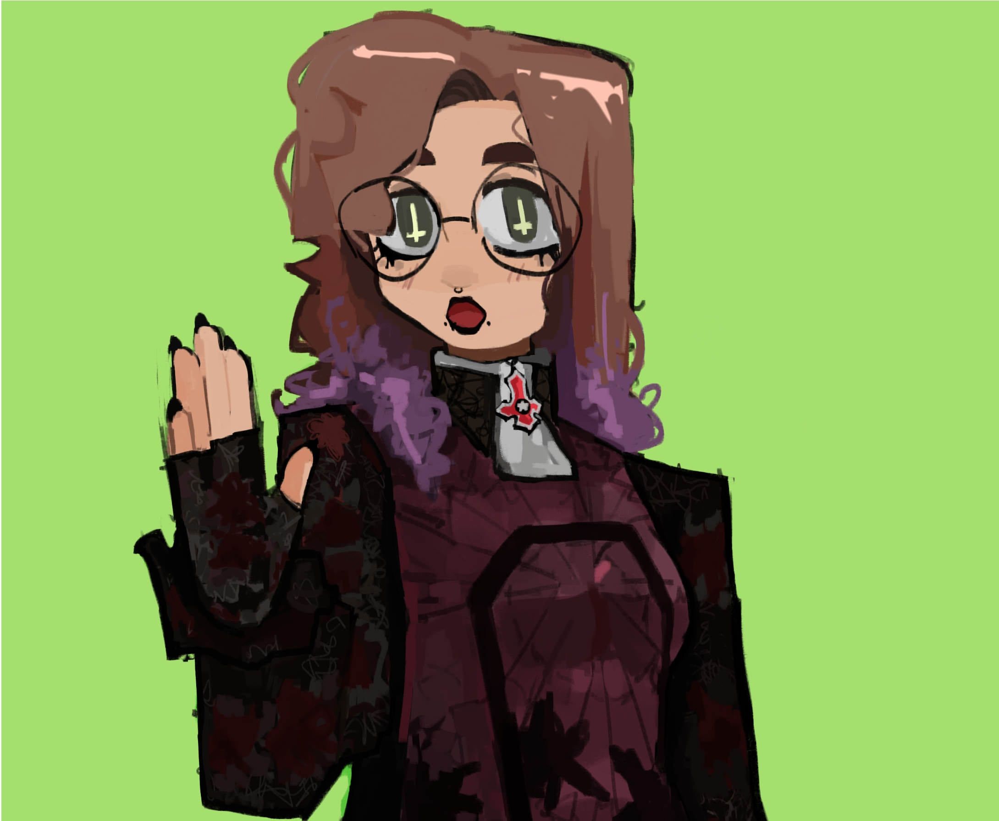
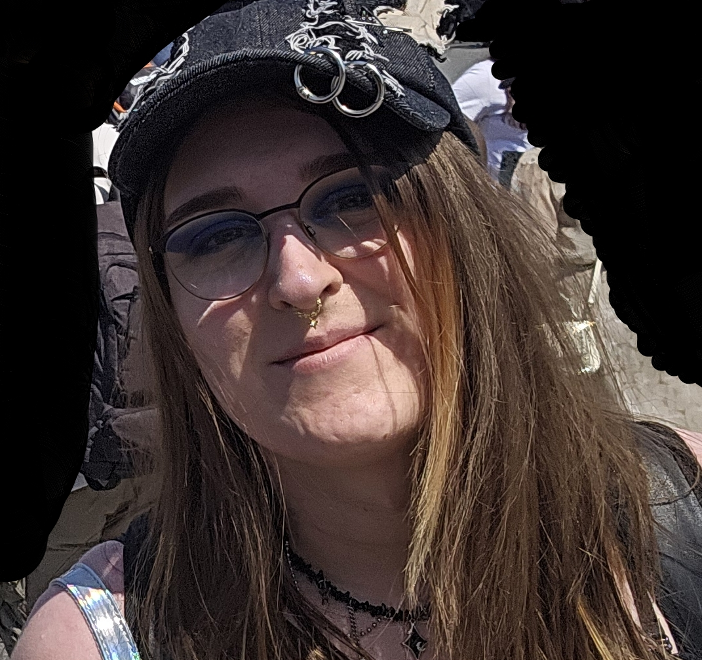

### Heya! I'm Asteria ✨

*puppy girl in disguise*

## **☕ About me**

- Name: **Asteria, 'Graphic'** 
- Residing in: **Germany**
- Pronouns: **she/her/it/its**
- Hoobies: **Programming, Cosplay, Playing Games**
- Work: **Software Engineer**
- Language: **English, German**
  

## **💻 Experience**

- burning with passion for useless and pointless things, and literally no survival skills in this society.
- I enjoy gaming, watching anime, reading manga, cosplaying, listening to music, and occasionally experimenting with tech stuff.
- I am a full time software engineer
## **📊 Github Stats**
<!-- 

 -->

 

## **🎧 Music**

<!--      -->
## **📫 Contact**
<!---->
**Please Contact me on Discord for a quick response:** [Graphicscore](https://discord.com/users/133976466265210880)

**You can also email me here:** contact@asteria.dog

<a href="https://github.com/Meghna-DAS/github-profile-views-counter">

